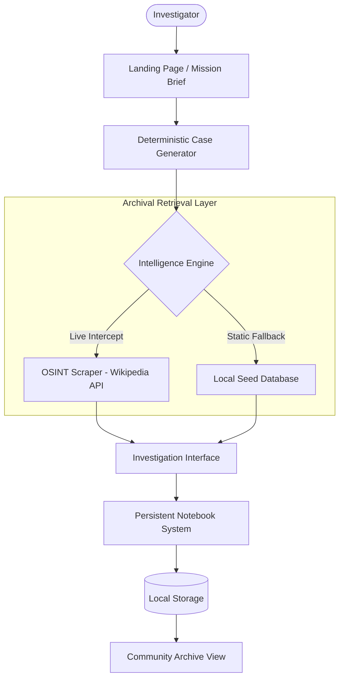

# 🕵️ CASE011: Archives of the Unexplained

**Each case is real. Each trail is incomplete. The truth is in the details.**


## 🌌 Overview

CASE011 is a professional-grade investigation platform designed for critical thinkers and researchers. It bridges the gap between historical archival records and interactive storytelling by leveraging a custom-built **OSINT (Open Source Intelligence) Scraper** to pull real-world mysteries directly into a cinematic investigation interface.

### 🧩 Key Pillars
- **Authenticity**: Every case is rooted in real-world documentation.
- **Immersion**: Experience a "Digital Terminal" aesthetic with CRT effects and vintage typing sequences.
- **Privacy**: Zero tracking, zero account requirements, and 100% serverless logic.
- **Innovation**: Real-time archival interception via Wikipedia Core.

---

## 🏗️ System Architecture

The platform operates on a decentralized, purely frontend architecture designed for speed and persistence.



---

## 📁 Project Structure

```text
case011/
├── index.html              # Central Hub & Typewriter Briefing
├── case.html               # The Investigation Interface
├── archive.html            # Community Intelligence Repository
├── mysteries.html          # Categorized Case Catalog
├── submit.html             # Theory Submission Portal
├── assets/                 # Visual Brand Identity
├── styles/                 # Cascading Style Sheets
│   ├── main.css            # Core Design System & Retro Theming
│   ├── components.css      # Reusable Dashboard Components
│   └── animations.css      # Motion Graphics & CRT Effects
├── js/                     # The Intelligence Logic
│   ├── aiGenerator.js      # LIVE OSINT Scraper Engine
│   ├── caseGenerator.js    # Seed Database & Hash Determinism
│   ├── notebook.js         # Interactive Notebook Controllers
│   ├── storage.js          # Submissions & Archive Data Management
│   ├── sharedArchive.js    # Data Synchronization Logic
│   └── utils.js            # Cryptographic & Utility Functions
└── README.md               # Tactical Documentation
```

---

## ⚡ Core Features

### 📡 LIVE OSINT Scraper
The system intercepts live archival streams from Wikipedia, focusing on unexplained phenomena, historical cold cases, and scientific anomalies.


### 📝 Interactive Notebook
- **Auto-Save**: Never lose a theory. Data is persistently stored in `localStorage`.
- **Chronological Stamping**: One-click timestamping for timeline reconstruction.
- **Word/Char Counter**: Track the density of your investigation.

### 🏛️ Community Archive
Browse theories submitted by other investigators. Reopen cases from their perspective or build upon their findings.

---

## 🛠️ Installation & Setup

CASE011 is designed to be lightweight and portable. No build steps are required.

### Recommended Launch Method
For full feature support (including Wikipedia API CORS handling in some environments), run via a local server:

```bash
# Using Node.js
npx -y serve . -p 8000

# Using Python
python -m http.server 8000
```

Access the terminal at `http://localhost:8000`.

---

## 🔒 Security & Policy

> [!NOTE]
> **Data Privacy**: All investigation notes and personal theories remain on your local device unless you explicitly click "Submit to Archive". No metadata is collected without consent.

> [!IMPORTANT]
> **Zero-Key Architecture**: This project uses public OSINT channels. No expensive API keys or external credits are required for full functionality.

---

## 📜 Credits & License

Created as a tactical research tool for curious minds. 
- **Fonts**: [Special Elite](https://fonts.google.com/specimen/Special+Elite), [Courier Prime](https://fonts.google.com/specimen/Courier+Prime).
- **Icons**: Standard UTF-8 Glyph set for zero dependency.

**Remember**: The trail is incomplete. The truth is in the details.
